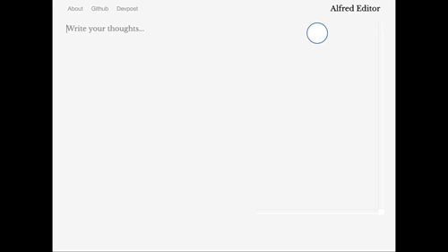

# Alfred Prufrock Editor  
Also known as Think Freely. 🌳 A web application, built on Node.js and Express, with Jade, D3, and GCP's NLP API to augment free-writing. Constructs, real-time, a tree that holds dependent nouns as nodes and recursively creates edges using morphology and syntax analysis. Edit
Add topics

### Configuration
- **Platform:** node
- **Framework**: express
- **Template Engine**: jade

### Demo

